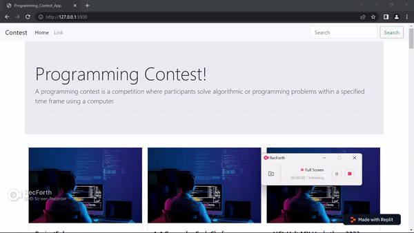

# Programming Contest App

Welcome to the Programming Contest App! This project is a web application that provides information about programming contests. Users can view a list of contests, including their status, start time, end time, and visit the contest websites for more details.

## Table of Contents

- [About](#about)
- [Installation](#installation)
- [Usage](#usage)
- [Contributing](#contributing)
- [License](#license)

## About

The Programming Contest App is designed to keep users updated about various programming contests. It fetches data from the [kontests.net](https://kontests.net) API to display the contests. Users can view the contest details and visit the contest websites directly from the app.

## Installation

To run the Programming Contest App locally, follow these steps:

1. Clone the repository or download the project files.
2. Open the `index.html` file in a web browser.

## Usage

Upon opening the app, you will see a list of programming contests. The app fetches data from the kontests.net API to dynamically generate the contest cards. Each card includes the contest name, status, start time, end time, and a button to visit the contest website.

You can click on the "Visit Contest" button to navigate to the contest website and learn more about the contest.

## Contributing

Contributions to the Programming Contest App are welcome! If you have any suggestions, bug reports, or feature requests, please submit them via GitHub issues. Feel free to fork the repository and create a pull request to contribute to the project.

## License

This project is licensed under the [MIT License](LICENSE).
